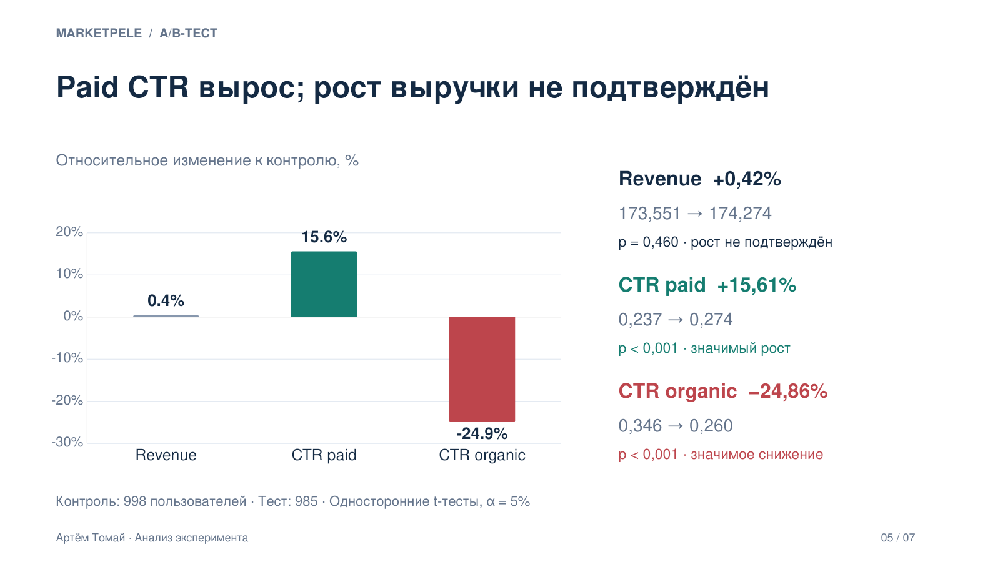

# Дизайн и анализ A/B-теста Marketpele

**Python · pandas · SciPy · A/B-тестирование · CUPED · продуктовая аналитика**

Учебный проект: от исследования исторических данных и расчёта чувствительности эксперимента до проверки результатов и рекомендации для бизнеса.

**Ключевой результат:** CTR платных элементов вырос примерно на **15,6%**, но статистически значимый рост выручки не обнаружен. Одновременно CTR органических элементов снизился примерно на **24,9%**. Рекомендация — **не внедрять текущий вариант интерфейса на всех пользователей**.

[Открыть исследование](notebooks/marketpele_ab_test.ipynb) · [Скачать презентацию](reports/Marketpele-AB-Test.pptx) · [Инструкция запуска](#как-запустить)



## Бизнес-задача

В ленте Marketpele размещаются платные рекламные объявления и органический контент издателей. Компания рассматривает новое расположение элементов, которое должно увеличить взаимодействие с рекламой и выручку платформы.

**Продуктовая гипотеза:** изменение расположения элементов повысит количество платных кликов на просмотр страницы и увеличит выручку на пользователя без неприемлемого ухудшения органического взаимодействия.

## Результаты эксперимента

В анализе **1 983 пользователя**: 998 в контрольной группе и 985 в тестовой.

| Метрика | Роль | Контроль | Тест | Относительное изменение | p-value | Вывод |
| --- | --- | ---: | ---: | ---: | ---: | --- |
| Revenue на пользователя | Основная | 173,551 | 174,274 | +0,42% | 0,460 | Рост не подтверждён |
| CTR paid | Прокси | 0,237 | 0,274 | +15,61% | < 0,001 | Значимый рост |
| CTR organic | Защитная | 0,346 | 0,260 | −24,86% | < 0,001 | Значимое снижение |

Проверка выполнена односторонними t-тестами для независимых групп при **α = 0,05**: на рост для Revenue и CTR paid, на снижение для CTR organic. Проценты приведены по расчётам ноутбука и являются приближёнными: средние перед расчётом изменения округлены до трёх знаков.

Здесь **CTR — число кликов на просмотр страницы**, а не доля кликов от показов отдельного объявления. В сравнении используются средние пользовательских метрик, а не отношение суммарных кликов к суммарным просмотрам.

### Решение для бизнеса

Результаты согласуются с перераспределением взаимодействия в пользу платного контента, но не подтверждают рост основной бизнес-метрики. Рекомендуется:

1. Исследовать путь пользователя после платного клика и причины отсутствия подтверждённого роста дохода.
2. Проверить альтернативные варианты расположения платного и органического контента.
3. Перед следующим тестом зафиксировать допустимое ухудшение защитной метрики и правила принятия решения.

## Что сделано

- **Предобработка и EDA:** типы данных, пропуски, распределения, верхние квантили, различия между устройствами, активность пользователей и корреляции метрик.
- **Подготовка исторических данных:** исключение строк выше 97-го перцентиля Revenue; сравнение характеристик до и после обработки.
- **Дизайн теста:** выбор единицы рандомизации, метрик, уровня значимости и мощности; расчёт MDE для 14, 21 и 28 дней.
- **Валидация дизайна:** 1 000 A/A-симуляций для оценки ложных срабатываний и 1 000 A/B-симуляций с искусственным эффектом для оценки мощности.
- **CUPED:** оценка снижения дисперсии и MDE на исторических периодах.
- **Анализ эксперимента:** проверка состава групп, описательная статистика, визуализация, t-тесты и бизнес-рекомендации.

## Дизайн на исторических данных

Исторический датасет содержит **89 353 строки**, **3 000 пользователей** и охватывает **1 января — 25 февраля 2026 года**. После обработки высоких значений Revenue осталось **86 672 строки**.

| Параметр | Значение |
| --- | --- |
| Планируемая длительность | 14 дней |
| Единица рандомизации и анализа | Пользователь, `user_id` |
| Распределение трафика | 50/50 |
| Уровень значимости | 5% |
| Целевая мощность | 80% |
| Пользователи в историческом 14-дневном окне | 2 914 |
| MDE без CUPED | ≈ 6,18% |
| Ложные срабатывания в A/A-симуляциях | 5,6% |
| Мощность в A/B-симуляциях при эффекте 6,18% | 80,1% |
| Оценка MDE с CUPED на исторических данных | ≈ 3,0% |

Увеличение исторического окна до 21–28 дней почти не увеличивало число уникальных пользователей и не улучшало относительный MDE.

**CUPED относится к этапу проектирования.** Историческая выручка в соседних 14-дневных периодах коррелирует на уровне 0,88; после корректировки стандартное отклонение снижается с 51,80 до 24,29. В анализе проведённого эксперимента CUPED **не применялся**.

## Структура репозитория

| Путь | Содержание |
| --- | --- |
| [`notebooks/marketpele_ab_test.ipynb`](notebooks/marketpele_ab_test.ipynb) | Полный анализ с кодом, пояснениями и сохранёнными результатами |
| [`reports/Marketpele-AB-Test.pptx`](reports/Marketpele-AB-Test.pptx) | Презентация на 7 слайдов: задача, дизайн, метрики, результаты и рекомендации |
| [`assets/ab-test-results.png`](assets/ab-test-results.png) | Превью результатов из презентации |
| [`data/README.md`](data/README.md) | Описание входных файлов и необходимых столбцов |
| [`requirements.txt`](requirements.txt) | Библиотеки анализа и JupyterLab |
| [`.gitignore`](.gitignore) | Исключения для локальных данных, окружения и служебных файлов |

## Как запустить

Для просмотра выводов достаточно открыть ноутбук или презентацию. Для повторного расчёта нужны **Python 3.10+** и два исходных CSV из учебного задания. CSV в репозиторий не включены.

### 1. Клонировать репозиторий

```bash
git clone https://github.com/hiakomi/marketpele-ab-test-analysis.git
cd marketpele-ab-test-analysis
```

### 2. Создать виртуальное окружение

```bash
python -m venv .venv
```

Активировать в Windows PowerShell:

```powershell
.\.venv\Scripts\Activate.ps1
```

Или в macOS / Linux:

```bash
source .venv/bin/activate
```

### 3. Установить зависимости

```bash
python -m pip install -r requirements.txt
```

### 4. Добавить данные

Поместить в папку `data/` файлы:

- `user_activity_data.csv` — историческая активность;
- `experiment_data.csv` — результаты эксперимента.

Названия и формат столбцов описаны в [`data/README.md`](data/README.md). Локальные CSV исключены из Git. Пути в ноутбуке относительные; редактировать путь к личной папке Downloads не требуется.

### 5. Открыть ноутбук

Из корня проекта:

```bash
python -m jupyterlab
```

Открыть `notebooks/marketpele_ab_test.ipynb` и выбрать **Kernel → Restart Kernel and Run All Cells**. Выполнение включает несколько тысяч симуляций, поэтому может занять некоторое время.

## Как интерпретировать результат

- Отсутствие статистически значимого роста Revenue **не доказывает отсутствие любого эффекта**. При имеющейся выборке небольшой эффект мог остаться незамеченным.
- Оценки MDE относятся к историческому дизайну. В итоговом эксперименте другой размер выборки; CUPED не применён. MDE ≈ 3% нельзя считать чувствительностью фактически проанализированного теста.
- Очистка исторических данных по Revenue влияет на оцениваемую метрику. Порог и правила обработки нужно фиксировать заранее; порог для дневных наблюдений нельзя напрямую переносить на суммарную выручку за эксперимент.
- Перераспределение внимания — возможная интерпретация изменений CTR. Долгосрочное удержание и удовлетворённость пользователей в проекте не измерялись.

